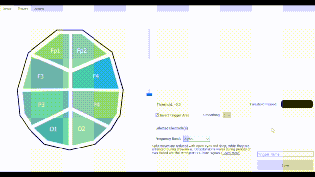
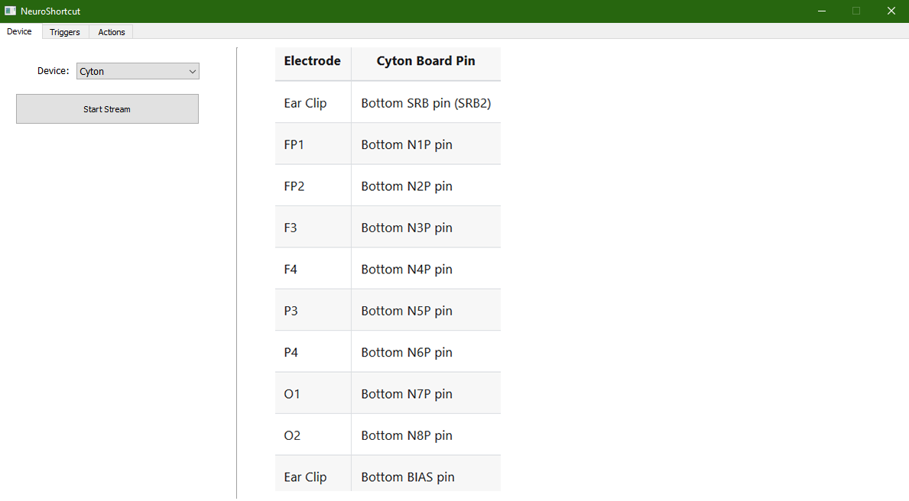
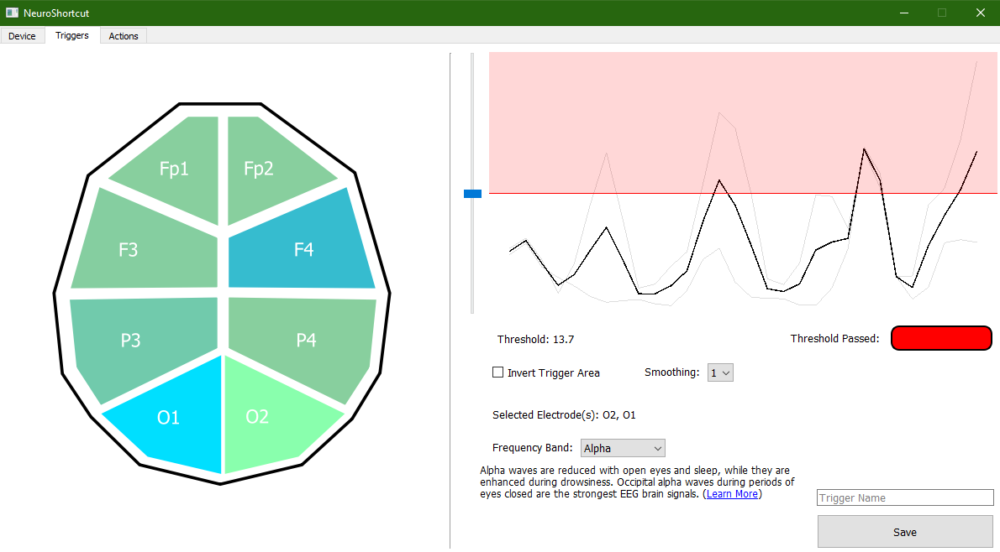
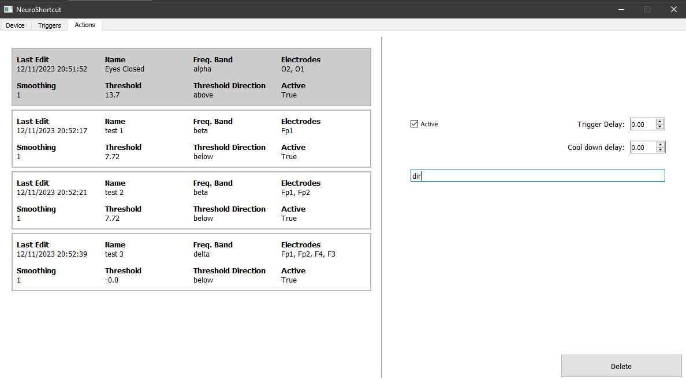

# NeuroShortcut
A brain-computer interface tool for triggering keyboard shortcuts, system commands, and macro scripts by changing mental states

## Supported Devices
This project was made using the 8 channel OpenBCI Cyton board. Support for more devices and electrode configurations will be added in the future.

## Frequency Band Thresholding
Triggers are built up from training to modulate activity in different regions of thr brain and in different frequency bands. [Learn more here](https://mentalhealthdaily.com/2014/04/15/5-types-of-brain-waves-frequencies-gamma-beta-alpha-theta-delta/)
Control methods based on motor imagery and sensory evoked potentials will be added at some point.

## Actions
The current version of NeuroShortcut can execute system commands from mental triggers. Future versions will be able to activate keyboard shortcuts and replay mouse movements as well.

